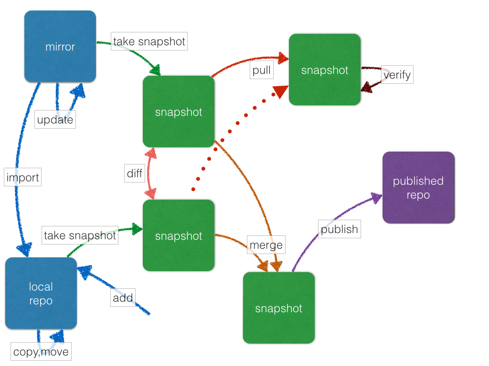

+++
date = 2014-03-11T16:14:00Z
title = "aptly 0.4"
+++

[aptly](http://www.aptly.info/) version 0.4 has been released today.
Major feature in this version is [local package repository
management](http://www.aptly.info/#aptly-repo) which allows to manage
collection of your own packages, publish, take snapshots, mix with
upstream repositories mirrors. Please [download
it](http://www.aptly.info/#download) or install from
[source](https://github.com/aptly-dev/aptly), [raise
issues](https://github.com/smira/aplty/issues), disscuss in
[aptly-discuss
group](https://groups.google.com/forum/#!forum/aptly-discuss), follow
[me (@smira)](https://twitter.com/smira/) to get information about
updates.

Other features in 0.4 worth mentioning are: support for source packages
for mirrors and local repositories, ability to delete unused package
files and DB entries, and memory usage optimizations.

Full list of changes in this version:

-   local package repositories are supported
-   aptly supports mirroring remote repos with source packages and
    publishing repositories with sources
-   new command: `aptly db cleanup` to remove unreferenced DB entries
    and files
-   aptly peak memory usage has been reduced by factor of 3x
-   new flags: `-keyring` & `-secret-keyring` for
    `aptly snapshot publish` command
-   new config: `downloadSourcePackages` to enable source package
    downloading
-   new flag: `-with-sources` for `aptly mirror create` command
-   new config & flag: `dependencyFollowSource` & `-dep-follow-source`
    to follow `Source:` dependencies
-   new commands in `aptly repo` family: `add`, `copy`, `create`,
    `drop`, `import`, `list`, `move`, `remove` and `show`
-   command `aptly snapshot create` supports creation of snapshots from
    local repos
-   new flag`-no-remove` for `aptly snapshot pull`: don't remove other
    version of packages when pulling (e.g. keep old versions)
-   command `aptly mirror create` supports shorthand PPA url:
    `ppa:user/project`
-   new config: `ppaDistributorID` & `ppaCodename` to specify PPA url
    expansion rules
-   packages are printed in lists with underscores instead of dashes,
    e.g. `pkg_1.3-3_amd64` instead of `pkg-1.3-3-amd64`

With addition of local package repositories, schema of aptly entities
and transitions looks like that:

